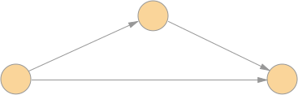
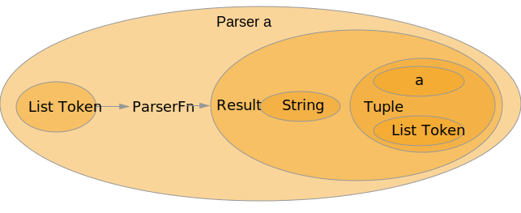

## Elm

#### a delightful language for reliable webapps


<a href="https://twitter.com/andikobler" target="_blank">@andikobler</a> <!-- .element: style="margin-top: 100px;" -->


## Agenda
* Elm: how it works
* Language basics
* Design patterns reloaded
* Parser combinators
* Use cases:
  * warm up: calculator
  * sketch: compiler for an ASR language model
* Elm tooling


## Elm: some facts
* developed by Evan Czaplicki
* appeared 2012
* compiles to HTML/JS/CSS

### so then, just another transpiler? <!-- .element: class="fragment" data-fragment-index="1" style="margin-top:30px; text-align: center;" -->

* avoid or catch errors early <!-- .element: class="fragment" data-fragment-index="2"-->
* enlightening compiler messages <!-- .element: class="fragment" data-fragment-index="2"-->
* easy refactoring <!-- .element: class="fragment" data-fragment-index="2"-->
* great rendering performance <!-- .element: class="fragment" data-fragment-index="2"-->
* astonishing programming experience <!-- .element: class="fragment" data-fragment-index="2"-->
* interoperability to JS guaranteed <!-- .element: class="fragment" data-fragment-index="2"-->

Note:
* Sales slide: what does Elm promise? why should I am interested in Elm?
* I am no frontend guy, why should am I interested in Elm at all?


## Functional programming: why

* essence of programming is <!-- .element: class="fragment" data-fragment-index="1"-->

* FP provides abstractions to keep that process scalable <!-- .element: class="fragment" data-fragment-index="2"-->
  * very simple at its core <!-- .element: class="fragment" data-fragment-index="2"-->
  * abstractions proven in other mathematical fields <!-- .element: class="fragment" data-fragment-index="2"-->

Note:
* what does FP provide that is not provided by imperative programming?
* no deep dive into theoretical concepts
* influence from academic world
* TODO: figure to chop/compose problems


## Functional programming: what's inside

 <!-- .element: class="fragment" -->

Note: 
* how to deal with multiple arguments? -> currying


## Functional programming: motivating example


 <!-- .element: class="fragment" -->


## Functional programming: wrap up
* separation: data and functions
* data:  <!-- .element: class="fragment" data-fragment-index="1"-->
  * is immutable  <!-- .element: class="fragment" data-fragment-index="1"-->
* functions: <!-- .element: class="fragment" data-fragment-index="2"-->
  * first class citizens <!-- .element: class="fragment" data-fragment-index="2"-->
    * can be treated like data, as long as not applied  <!-- .element: class="fragment" data-fragment-index="2"-->
  * are pure: same input => same output <!-- .element: class="fragment" data-fragment-index="2"-->
  * do not describe effects! <!-- .element: class="fragment" data-fragment-index="2"-->
    * effects are described by data and run by runtime <!-- .element: class="fragment" data-fragment-index="2"-->
* makes substituting very easy .oO( refactoring ) <!-- .element: class="fragment" data-fragment-index="3"-->
* comes with its own design patterns <!-- .element: class="fragment" data-fragment-index="3"-->

Note: 
* allows runtime to do: smart optimizations
* declarative approach
* equational reasoning
* lazy evalutation: elm is not lazy


## The elm architecture: basics
* functional reactive programming (FRP)
* basic ingredients:
  * data: Model, Msg, Html
  * function: update, view


```bash
npm install elm -g
mkdir elm-hello-world; cd elm-hello-world
elm-make   # create basic skeleton
mkdir src && touch src/Main.elm
elm-reactor   # runs webserver on localhost:8000
``` 
* paste <a href="https://github.com/akobler/elm-intro/blob/gh-pages/snippets/01_hello-world.elm" target="_blank">hello world</a> code 

Note:
* show 01_basic-program.elm


## The elm architecture: advanced
* beside of HTML, our code might produce:
  * commands: trigger an action (HTTP request etc.)
  * subscriptions: register on events (websockets etc.)

* all effects are described by data an run by runtime
* .oO( teaser for another talk ? )


## Language basics
* data types
* functions
* let
* branching
* pattern matching


## Data types
* statically typed
  * type known at compile time
* type inference
  * no need to write type for an identifier, compiler knows it anyway
* no implicit type conversions
* type names: start with upper case
* value/function identifiers: start with lower case

### hey, show me code!  <!-- .element: class="fragment" -->

Note:
* type inference: auto in C++
* identifier instead of variable name -> all values are immutable


## Data types: primitives
* Char, String, Int, Float, Bool
* type is inferred

```elm
-- some values
myChar = 'a'
myString = "hello Bern"
myInt = 5
myFloat = 5.0
myBool = True
```
* useful functions on primitives: <a href="http://package.elm-lang.org/packages/elm-lang/core/5.1.1/Basics" target="_blank">elm-lang / core / Basics</a>

Note:
* demonstration in repl
* type: 'c'
* type: 'c' == 'd'
* type: 'c' == 4.0
* myLength = 183.5
* myLength - 1
* myLength = myLength - 1
* yourLength = myLength - 1


## Data types: Algebraic Data Types (ADTs)
* building blocks to create data structures


* all other data structures are built with these building blocks <!-- .element: class="fragment" -->

Note:
* expectation: array, list, dict, set -> can all be built with Product Type and Sum Type
* primitives and ADTs: all other data types can be built upon those


## Data types: tuple
```elm
-- tuple
myTuple = ("hallo", 8.0, True)
```


## Data types: record

```elm
-- unnamed record
myPerson = 
  { age = "0x20"
  , bodyLength = 183.5
  , name = "Andi"
  , sex = "male"
  , status = "sitting"
  }
```


## Data types: record, type alias
* type alias: give a type another name
* works for all types,
  * primitives
```elm
type alias Velocity = Float
```
  * records
```elm
type alias Person = 
  { age : String
  , bodyLength : Float
  , name : String
  , sex : String 
  , status : String
  }
```

Note:
* create a person by typing: Person "0x20" 183.0 "andi" "male" "sitting"
* show that Person is actually a function, the type constructor


## Data types: record, get field
* for each field, a get function is available

```elm
-- record field getter
myPerson.name

-- .name is the function, myPerson the argument
.name myPerson
```


## Data types: record, set field
* __attention__: all data immutable, you get a copy!

```elm
-- change a field value of a record
updatedPerson = { myPerson | name = "Beni" }
```

* pitfall: type change possible (but not useful)

```elm
-- change a field value and its type
updatedPerson = { myPerson | name = 'a' }

-- name field changed type to Char, so
-- updatedPerson has now another type than myPerson!
```

* field must exist, addition/deletion not possible


## Data types: record, type constructor

```elm
type alias Person = 
  { age : String
  , bodyLength : Float
  , name : String
  , sex : String 
  , status : String
  }
```
```elm
-- construction as we did
myPersonA =
  { age = "0x20"
  , bodyLength = 183.5
  , name : "Andi"
  , sex : "male"
  , status : "sitting"
  }

-- type constructor
myPersonB = Person "0x20" 183.5 "Andi" "male" "sitting"

myPersonA == myPersonB
```
* .oO( the only functions starting with uppercase letter)


## Data types: union
* gateway drug: think of an enum, to keep models clean

```elm
type Sex = Male
  | Female

mySex = Male -- .oO( type constructor )
```
```elm
type Status = Sitting
  | Standing
  | Sleeping
  | Moving

myStatus = Moving
```

* Wouldn't it feel natural, to attach the current velocity directly to the information "Moving"? <!-- .element: class="fragment" -->


## Data types: union, tagged
* good news: it's possible

```elm
type Status = Sitting
  | Standing
  | Sleeping
  | Moving Float

myStatus = Moving 3.4
```

* very powerful tool to build clean and concise data models  <!-- .element: class="fragment" -->
* "Making impossible states impossible", Richard Feldman <!-- .element: class="fragment" -->


## Data types: List
* recall: all data structures can be built upon
  * sum type: union
  * product type: tuple, record

```elm
type MyFloatListT = MyFloatList (Float, MyFloatListT)
  | End

MyFloatList (1, (MyFloatList( 2, (MyFloatList (3, End )))))
```
<!-- .element: class="fragment"  data-fragment-index="1"-->

* factor out content type: type parameters start lower case <!-- .element: class="fragment"  data-fragment-index="2"-->

```elm
type MyListT a = MyList (a, MyListT a)
  | End

-- works with String
MyList ("s", MyList ( "t", MyList ("r", End )))

-- works with Float
MyList (1, (MyList( 2, (MyList (3, End )))))
```
 <!-- .element: class="fragment"  data-fragment-index="2"-->


## Data types: List
* syntactical sugar: []

```elm
myList = [1,2,3]
myList = ["s", "t", "r"]
```

useful List functions: <a href="http://package.elm-lang.org/packages/elm-lang/core/5.1.1/List" target="_blank">elm-lang / core / List</a>


### Functions: signature and definition
* fns are often used: keep syntax slim
* type signature
  * indicates arguments and return types
  * optional, compiler infers it anyway :)

```elm
-- one argument
addOne : Int -> Int
addOne n = 
  n + 1

-- multiple arguments
add : Int -> Int -> Int
add n m = 
  n + m
```


### Functions: anonymous function
* function definition without name
* useful to define a function ad-hoc

```elm
\x -> x * 2     -- one arg
\x y -> x * y   -- two args
```

* all multi-args fns are internally handled as nested anonymous fns <!-- .element: class="fragment"  data-fragment-index="0"-->

```elm
add1 x = x + 1        -- one arg
add1 = \x -> x + 1
```
<!-- .element: class="fragment"  data-fragment-index="0"-->
```elm
add x y = x + y       -- two args
add x = \y -> x + y
add = \x -> (\y -> x + y)
```
<!-- .element: class="fragment"  data-fragment-index="1"-->
* that explains the function type signature <!-- .element: class="fragment"  data-fragment-index="2"-->

```elm
\x -> (\y -> x + y) : Int -> Int -> Int
```
<!-- .element: class="fragment"  data-fragment-index="2"-->


### Functions: higher order functions

* take a function as an argument

```elm
List.filter isEven [1, 2, 3, 4]
-- [2, 4]

List.map (\x -> x * 5) [1, 2, 3, 4]
-- [5, 10, 15, 20]
```


### Functions: infix operators

* function with two arguments
* precedence 0-9, default 9 (0 is tighest)
* associativity: default is left

```elm
-- definition
(<+>) : a -> a -> a
(<+>) left right = 
  left + right 

-- usage
3 <+> 8
```


### Functions: pipes for application

* essential: chain function application
  * "put an arg into a fn, forward the return value into the next fn"

```elm
-- the imperative programmers try
calculate : Int -> Int
calculate x = 
  abs (sqrt (5 * x))
```

* increase readability with pipes <!-- .element: class="fragment"  data-fragment-index="1"-->

```elm
-- (|>) : a -> (a -> b) -> b
-- x |> f == f x

calculate : Int -> Int
calculate x = 
  5 * x
  |> sqrt
  |> abs
```
 <!-- .element: class="fragment"  data-fragment-index="1"-->


### Functions: pipes for composition

* essential: combine functions
  * build a new fn, given two existing fns

```elm
-- f >> g == \x -> g(f x)
-- (>>) : (a -> b) -> (b -> c) -> a -> c
isOdd : Int -> Bool
isOdd = 
  isEven >> not
```


### Function body: let
* give a value a name
```elm
calc : Int -> Int -> Int
calc x y = 
    let
        intermediate = x + y
    in
        intermediate * 8
```
* remind: in FP, a function is first class
```elm
calc : Int -> Int -> Int
calc x y =
    let
        innerCalc a b = a + b
    in
        (innerCalc x y) * 8
```


### Function body: if then else
* both branches must:
  * be defined
  * evaluate to the same type
```elm
gt : Int -> Int -> Bool
gt a b = 
    if a > b then
      True
    else
      False
```


### Function body: case of
* pattern matching
```elm
toAbbrevation sex =
    case sex of
        Male -> "m"
        Female -> "f"
```
<!-- .element: style="width: 850px;"-->
```elm
showState status =
    case status of
        Sleeping -> "sleeping"
        _ -> "awake"
```
<!-- .element: class="fragment" data-fragment-index="1" style="width: 850px;"-->
```elm
showDetailedState status =
    case status of
        Sleeping -> "sleeping"
        Standing -> "standing"
        Sitting -> "sitting"
        Moving velocity -> "moving (" ++ toString velocity ++ ")"
```
<!-- .element: class="fragment"  data-fragment-index="2" style="width: 850px;"-->

* useful cheatsheet:  <!-- .element: class="fragment"  data-fragment-index="3" --> <a href="https://gist.github.com/yang-wei/4f563fbf81ff843e8b1e" target="_blank">Elm destructuring cheatsheet</a> <!-- .element: class="fragment"  data-fragment-index="3" -->


## Design patterns reloaded

* reuse of proven abstractions
* depend on a language's paradigm and possibilities

Note:
* Functions are not sitting on a data type, so OO patterns do not work


## Design patterns reloaded: useful ADTs
* Maybe
  * nothing or value of type a inside
  * . o O ( boost::option )


* Result    <!-- .element: class="fragment" data-fragment-index="1"-->
  * Err a or Ok b inside        <!-- .element: class="fragment" data-fragment-index="1"-->
  * . o O ( Either )   <!-- .element: class="fragment" data-fragment-index="1"-->

<!-- .element: class="fragment" data-fragment-index="1"-->

Note:
* Maybe: List.head [], List.head [1]
* Result: String.toFloat "1", String.toFloat "a"


## Design patterns reloaded: currying, the problem
* problem: fn expects multiple args, fn chaining works only for 1-arg fns


* actually, a function is just an arrow ...

<!-- .element: class="fragment" -->

* remind: FP's core is and stays simple, no hacks!  <!-- .element: class="fragment" -->


## Design patterns reloaded: currying, the solution
  * fns are first class citizens: can be passed around as args and return values
  * substitution to the rescue!


<!-- .element: class="fragment" -->

```elm
divide x y = x / y 
divide x = \y -> x / y
divide = \x -> (\y -> x / y)
divide 6    -- 6 |> (\x -> (\y -> x / y))          =>  \y -> 6 / y
divide 6 3  -- 3 |> (6 |> (\x -> (\y -> x / y)))   =>  3 |> (\y -> 6 / y)  => 6 / 3
```
<!-- .element: class="fragment" -->


## Design patterns reloaded: currying,   example

```elm
add x y = x + y

calculate x = 
  5 * x
  |> add 3        -- <- here we rock :)
  |> abs
```

* .oO( kind of dependency injection ) <!-- .element: class="fragment" -->


## Design patterns reloaded: map
  * problem: function existing, but it operates on box content
  


```elm              
add1 x = x + 1
[1,2,3] |> List.map add1

-- depending on box type, map may have clever glue logic
Just 1 |> Maybe.map add1
Nothing |> Maybe.map add1
```
<!-- .element: class="fragment" -->

Note:
* currying: fn is applied on map, so "map fn" expectes one argument


## Design patterns reloaded: andThen
  * problem: fn produces some boxed output, but next fn wants box content
  


```elm
List.tail [1,2,3] |> Maybe.andThen List.tail

-- andThen has clever glue logic, if a List.tail returns a Nothing
List.tail [] |> Maybe.andThen List.tail
```
<!-- .element: class="fragment" data-fragment-index="1"-->
* . o O ( bind, flatMap, ... ) <!-- .element: class="fragment" data-fragment-index="2"-->

Note:
* currying: fn is applied on map, so "map fn" expects one argument


## Simple Compiler architecture


* Tokenizer: take input string and split on spaces
* Parser: take list of strings, produce Abstract Syntax Tree (AST)
* Backend: take AST, evaluate it and produce compilation

<p>__mapped to Elm language elements:__</p>
* orange: data
* blue: functions (it's FP :)

Note:
* Parser has to know the structure of the input token stream in order to transform the input stream to the structured data


## Parser combinators: the gist

* a single parsing function can be modelled

```elm
-- the very gist of a parsing function:
type alias ParserFn a = InputTokens -> Result String (a, RemainingTokens)
```


## Parser combinators: a one-token-eater

```elm
-- a concrete, simple parsing function (simplified, won't compile)
eatOneToken : ParserFn Token
eatOneToken inputTokens = Ok (head inputTokens, tail inputTokens)
```
```elm
-- build up more complex things: parse an addition string "1 + 2"
parseAddition : ParserFn Token
parseAddition inputTokens = oneToken oneToken oneToken ???
```
<!-- .element: class="fragment" data-fragment-index="1"-->


## Parser Combinators: resulting AST type

* Abstract Syntax Tree
  * data values and structual information
* AST type for a simple calculator


## Parser Combinators: resulting AST value

* concrete AST for calculator expression: 1 + 2 * 3


## Parser Combinators: what we need

* toolset of different parser functions that <!-- .element: class="fragment" data-fragment-index="1"-->
  * "eat" different kind of tokens <!-- .element: class="fragment" data-fragment-index="1"-->
  * recall what information (in which context) was eaten <!-- .element: class="fragment" data-fragment-index="1"-->
* glue functions to combine those simple parser functions to more complex parser functions <!-- .element: class="fragment" data-fragment-index="2"-->


## Parser Combinators: add a Parser box

* put the parser function (ParserFn) in a box called "Parser"



* function application is delayed
  * it waits in the box until it is unwrapped and run with an input token list


## Parser Combinators: glue functions

* the __and__ combinator
  * "glue" function that expects two parsers of type __a__ and __b__ and produce a parser of type __(a, b)__


* resulting parser:
  * after the combination we get a parser box with a new type
  * function inside is the combination of the two input parsers whereby the combination technique depends on the kind of "glue"


## Use case: parser for calculator

* example source code: <a href="https://github.com/akobler/elm-calculator" target="_blank">github.com/akobler/elm-calculator</a>
* 1) starting point: chain three basic parsers with "and" parser combinator

```elm
-- definition of a parser that accepts strings like "1 + 2"
addition = (float and plus) and float

-- left = float and plus                     : Parser (Float, String)
-- addition = left and float                 : Parser ((Float, String), Float)
```

```elm
-- infix version of and: .>>. == and
addition = (float .>>. plus) .>>. float
```
<!-- .element: class="fragment" data-fragment-index="0"-->

* 2) at each step, keep only data that we need <!-- .element: class="fragment" data-fragment-index="1"-->

```elm
addition = (float .>> plus) .>>. float       -- .>>. == and

-- left = float .>> plus                     : Parser Float
-- addition = left .>>. plus                 : Parser (Float, Float)
```
<!-- .element: class="fragment" data-fragment-index="1"-->


## Use case: parser for calculator

* 3) map the information in Parser (Float, Float) to a parser that holds our AST data structure, Parser Exp
  * each Parser is a "box", so we can define a map function for that box


```elm
addition = float .>> plus .>>. float  |>> EAdd        -- |>> == map

-- beforeMap = float .>> plus .>>. float              : Parser (Float, Float)
-- addition = beforeMap |>> EAdd                      : Parser Exp
```

* EAdd is type constructor : (Float, Float) -> Exp
* |>> is Parser.map

```elm
-- same as above
addition = beforeMap |> Parser.map EAdd
```


## Use case: parser for ASR language model

* language model
  * reduce search space (degree of freedom) with prior information
* language model can be described as DFA  <!-- .element: class="fragment" data-fragment-index="1"-->

<!-- .element: class="fragment" data-fragment-index="1"-->

```elm
model = ((hi? i like)? a ( coffee | tea) please?
```
<!-- .element: class="fragment" data-fragment-index="2"-->


## Parser combinators: wrap-up

* Pros
  * convenient way to define a parser (considering yacc etc.)
  * embedded in host language -> profit from type system
  * generates quite some "aha effects" :-)

* Cons <!-- .element: class="fragment" data-fragment-index="2"-->
  * can be slow for bigger grammars (backtracking) <!-- .element: class="fragment" data-fragment-index="2"-->
  * countermeasure:  <!-- .element: class="fragment" data-fragment-index="2"-->
   * reduce possibilites with appropriate tokens, if possible (strings vs chars)  <!-- .element: class="fragment" data-fragment-index="2"-->


## Tooling
* elm-repl: elm command line
* elm-reactor 
  * webserver that compiles and serves JS/HTML/CSS
  * convenient during development
  * game changing <a href="https://pragmaticstudio.com/tutorials/elm-debugger" target="_blank">debugging capabilities</a> to reproduce bugs
* elm-make 
  * complete site
  * single assets that can be embedded
* elm-package 
  * semantic versioning
  * exact tracking of API changes: e.g. change of function signatures
* <a href="https://github.com/elm-community/elm-test" target="_blank">elm-test</a>: write unit and fuzz tests


## Recap

* avoid or catch errors early: yes, make impossible states impossible <!-- .element: class="fragment" data-fragment-index="0"-->
* enlightening compiler messages: yes, compiler knows types well <!-- .element: class="fragment" data-fragment-index="1"-->
* easy refactoring: yes, substitution is easy <!-- .element: class="fragment" data-fragment-index="2"-->
* great (rendering) performance: yes, caching of pure functions is easy <!-- .element: class="fragment" data-fragment-index="3"-->
* astonishing programming experience: yes, we had fun <!-- .element: class="fragment" data-fragment-index="4"-->
* interoperability to JS guaranteed: it's your turn to try :-) <!-- .element: class="fragment" data-fragment-index="5"-->


## Resources: Elm
* Main website: <a href="http://elm-lang.org" target="_blank">http://elm-lang.org</a>
* Inspiring talks
  * <a href="http://www.elmbark.com/2016/03/16/mainstream-elm-user-focused-design" target="_blank">Let's be mainstream</a>, Evan Czaplicki
  * <a href="https://www.youtube.com/watch?v=IcgmSRJHu_8" target="_blank">Making impossible states impossible</a>, Richard Feldman
* Local community
  * <a href="https://www.meetup.com/de-DE/Elm-Zurich/" target="_blank">Elm Zurich</a>
  * <a href="https://elmeurope.org/" target="_blank">Elm Europe 2017, Paris</a>


## Resources: Functional Programming
* Category theory for programmers, <a href="https://twitter.com/bartoszmilewski" target="_blank">Bartosz Milewski</a>
  * <a href="https://www.youtube.com/watch?v=I8LbkfSSR58&list=PLbgaMIhjbmEnaH_LTkxLI7FMa2HsnawM_" target="_blank">Video serie</a>
  * <a href="https://bartoszmilewski.com/2014/10/28/category-theory-for-programmers-the-preface/" target="_blank">Blog Articles</a>
  * Next video serie soon, stay tuned: <a href="https://twitter.com/bartoszmilewski" target="_blank">@BartoszMilewski</a>
* F# for fun and profit, <a href="https://twitter.com/ScottWlaschin" target="_blank">Scott Wlaschin</a>
  * <a href="https://fsharpforfunandprofit.com/" target="_blank">Main website</a>
  * <a href="https://fsharpforfunandprofit.com/fppatterns/" target="_blank">FP design patterns</a>
  * <a href="https://fsharpforfunandprofit.com/rop/" target="_blank">Railway oriented programming</a>
  * <a href="https://fsharpforfunandprofit.com/monadster/" target="_blank">Dr Frankenfunctor and the Monadster</a>


## Resources: Parser Combinators
* <a href="https://fsharpforfunandprofit.com/parser/" target="_blank">Understanding parser combinators</a>, Scott Wlaschin
* <a href="http://package.elm-lang.org/packages/Bogdanp/elm-combine/latest" target="_blank">elm-combine: production ready lib for Elm</a>, Bogdan Popa